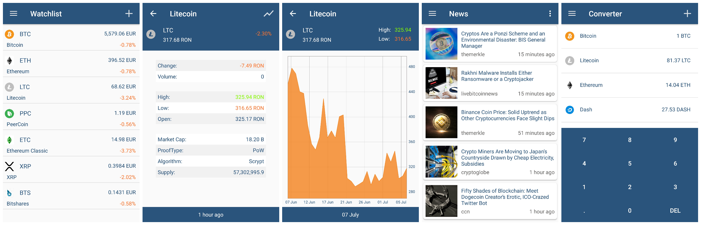

# Kryptolytics

## Update

**This application is a fork of the abandoned Gitlab project 'Cryptolitycs' by Szathmary Levente (lszathmary), the free public API that was provided by cryptocompare.com in CryptoLitycs is no longer available. I will update this to a working API once commencing further development on this project.**

## Description

Kryptolytics is a cryptocurrency tracker developed for Android.
It gives you quick and easy access to information about cryptocurrencies like
Bitcoin and many others.

## Features

 * Detailed information on every coin such as: Percentage change, Available supply,
 Market cap, Highest & Lowest prices.

 * With the help of the generated price charts, the user can track price changes
over the past 30 days.  

 * Choose from a selection of more than 4000 different coins, including
 popular coins like Bitcoin, Ethereum, Tether, Solana, Cardano, Ripple and many more.

 * Contains a usable converter, which allows multiple conversions at once and
 provides up to 8 decimal places when needed for greater accuracy.

 * Also shows the most recent cryptocurrency related news from different reliable sources.

## Libraries

The charts in the application are generated with help of 
[MP Android Chart](https://github.com/PhilJay/MPAndroidChart) library.

## Data Source

The application obtains all the cryptocurrency related data from 
[CryptoCompare](https://www.cryptocompare.com/) using the API provided by them.
